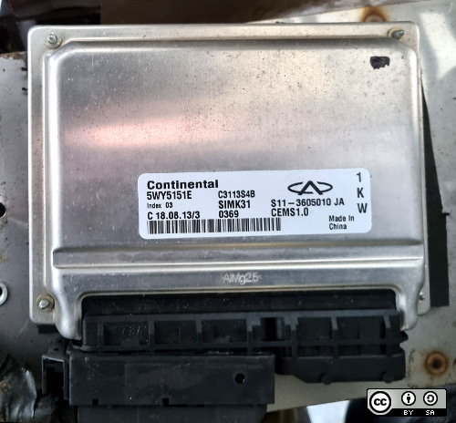
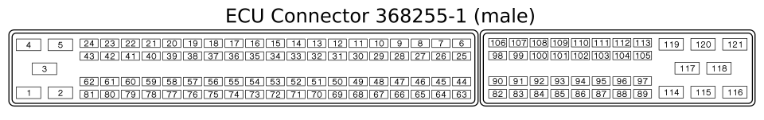

# ECU S11-3605010

An Engine Control Unit (ECU), or Electronic Control Module (ECM), for cars.

## Variations
| Part Number   | Manufacturer           | Chery Engine  |
|-------------- |:----------------------:|--------------:|
| S11-3605010BA | Siemens                |  800cc SQR372 |
| S11-3605010BG | Marreli                |  800cc SQR372 |
| S11-3605010BW | Marreli                |  800cc SQR372 |
| S11-3605010CJ | Marreli                |  800cc SQR372 |
| S11-3605010EA | Marreli                |  800cc SQR372 |
| S11-3605010FA | Marreli                |  800cc SQR372 |
| S11-3605010GA | Marreli                |  800cc SQR372 |
| S11-3605010HA | Continental            |  800cc SQR372 |
| S11-3605010MA | Marreli                |  800cc SQR372 |
| S11-3605010PA | Marreli                |  800cc SQR372 |
| S11-3605010TA | Siemens                |  800cc SQR372 |
| S11-3605010VA | Marreli                |  800cc SQR372 |
| S11-3605010CG | Marreli                | 1100cc SQR472 |
| S11-3605010CH | Marreli                | 1100cc SQR472 |
| S11-3605010JA | Siemens or Continental | 1100cc SQR472 |
| S11-3605010KA | Marreli                | 1100cc SQR472 |
| S11-3605010LA | Marreli                | 1100cc SQR472 |
| S11-3605010RC | Marreli                | 1100cc SQR472 |
| S11-3605010UA | Marreli                | 1100cc SQR472 |
| S11-3605010WA | Marreli                | 1100cc SQR472 |

## Used in
* Chery QQ
* Dazon 1100
* Joyner JNSZ1100SVB
* Joyner JNSZ1100TR-T4
* Joyner TROOPER T2

## Connector Pinout (for SQR372 engine)

| Pin | Description                                   |    | Pin | Description |
|---- |:---------------------------------------------:|:--:|:---:|------------:|
| 1   | Ground                                        |    | 82  | Not used    |
| 2   | Ground                                        |    | 83  | Not used    |
| 3   | Ignition coil 3                               |    | 84  | Not used    |
| 4   | Ignition coil 1                               |    | 85  | Not used    |
| 5   | Ignition coil 2                               |    | 86  | Not used    |
| 6   | CAN bus low signal                            |    | 87  | Not used    |
| 7   | CAN bus high signal                           |    | 88  | Not used    |
| 8   | Oxygen sensor signal                          |    | 89  | Not used    |
| 9   | Not used                                      |    | 90  | Not used    |
| 10  | Knock sensor signal                           |    | 91  | Not used    |
| 11  | Not used                                      |    | 92  | Not used    |
| 12  | AC evaporator temperature sensor signal       |    | 93  | Not used    |
| 13  | AC evaporator temperature sensor ground       |    | 94  | Not used    |
| 14  | Not used                                      |    | 95  | Not used    |
| 15  | Not used                                      |    | 96  | Not used    |
| 16  | Not used                                      |    | 97  | Not used    |
| 17  | Not used                                      |    | 98  | Not used    |
| 18  | Not used                                      |    | 99  | Not used    |
| 19  | Idle speed actuator stepmotor A+              |    | 100 | Not used    |
| 20  | Idle speed actuator stepmotor A-              |    | 101 | Not used    |
| 21  | Main relais power supply                      |    | 102 | Not used    |
| 22  | Power supply ignition switch                  |    | 103 | Not used    |
| 23  | Injector cylinder 3                           |    | 104 | Not used    |
| 24  | Injector cylinder 1                           |    | 105 | Not used    |
| 25  | Not used                                      |    | 106 | Not used    |
| 26  | Carbon canister solenoid valve                |    | 107 | Not used    |
| 27  | Crankshaft position sensor ground             |    | 108 | Not used    |
| 28  | Not used                                      |    | 109 | Not used    |
| 29  | Crankshaft position sensor input              |    | 110 | Not used    |
| 30  | Crankshaft position sensor ground             |    | 111 | Not used    |
| 31  | Coolant temperature sensor signal             |    | 112 | Not used    |
| 32  | Trottle valve position sensor input           |    | 113 | Not used    |
| 33  | Not used                                      |    | 114 | Not used    |
| 34  | Not used                                      |    | 115 | Not used    |
| 35  | Idle speed actuator stepmoter B+              |    | 116 | Not used    |
| 36  | Idle speed actuator stepmoter B-              |    | 117 | Not used    |
| 37  | Not used                                      |    | 118 | Not used    |
| 38  | Trottle valve position sensor ground          |    | 119 | Not used    |
| 39  | Speed signal                                  |    | 120 | Not used    |
| 40  | Not used                                      |    | 121 | Not used    |
| 41  | Not used                                      |    |     |             |
| 42  | Not used                                      |    |     |             |
| 43  | Oxygen sensor signal                          |    |     |             |
| 44  | Not used                                      |    |     |             |
| 45  | Trottle valve position sensor +5V             |    |     |             |
| 46  | Air intake temperature pressure sensor +5V    |    |     |             |
| 47  | Not used                                      |    |     |             |
| 48  | Air intake temperature pressure sensor ground |    |     |             |
| 49  | Not used                                      |    |     |             |
| 50  | Power supply +12V                             |    |     |             |
| 51  | Not used                                      |    |     |             |
| 52  | Not used                                      |    |     |             |
| 53  | Not used                                      |    |     |             |
| 54  | Knock sensor ground                           |    |     |             |
| 55  | Ignition coil ground                          |    |     |             |
| 56  | Air intake temperature pressure sensor signal |    |     |             |
| 57  | Not used                                      |    |     |             |
| 58  | Air condition application                     |    |     |             |
| 59  | Oxygen sensor ground                          |    |     |             |
| 60  | Air intake temperature pressure sensor ground |    |     |             |
| 61  | Injector cylinder 2                           |    |     |             |
| 62  | Not used                                      |    |     |             |
| 63  | Power supply +12V                             |    |     |             |
| 64  | High-speed fan relay control                  |    |     |             |
| 65  | High-speed fan relay control output           |    |     |             |
| 66  | Engine revolution speed signal output         |    |     |             |
| 67  | Main realis control output                    |    |     |             |
| 68  | A/C relais control output                     |    |     |             |
| 69  | Oil pump relais output                        |    |     |             |
| 70  | Failure indication light                      |    |     |             |
| 71  | Not used                                      |    |     |             |
| 72  | Crankshaft position sensor output             |    |     |             |
| 73  | Coolant temperature sensor ground             |    |     |             |
| 74  | Power steering pressure switch signal         |    |     |             |
| 75  | Not used                                      |    |     |             |
| 76  | Not used                                      |    |     |             |
| 77  | Diagnostic K-wire                             |    |     |             |
| 78  | Not used                                      |    |     |             |
| 79  | Not used                                      |    |     |             |
| 80  | Not used                                      |    |     |             |
| 81  | Not used                                      |    |     |             |

## Warranty
THIS INFORMATION IS PROVIDED "AS IS", WITHOUT WARRANTY OF ANY KIND, EXPRESS OR
IMPLIED, INCLUDING BUT NOT LIMITED TO THE WARRANTIES OF MERCHANTABILITY,
FITNESS FOR A PARTICULAR PURPOSE AND NONINFRINGEMENT. IN NO EVENT SHALL THE
AUTHORS OR COPYRIGHT HOLDERS BE LIABLE FOR ANY CLAIM, DAMAGES OR OTHER
LIABILITY, WHETHER IN AN ACTION OF CONTRACT, TORT OR OTHERWISE, ARISING FROM,
OUT OF OR IN CONNECTION WITH THIS INFORMATION.
